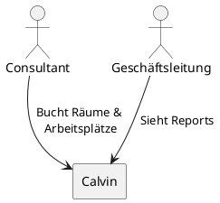
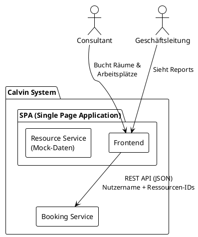

# Architekturdokumentation Calvin

---

## Einführung und Ziele

### Aufgabenstellung

Calvin ist INNOQs internes Raum- und Arbeitsplatzbuchungssystem zur Verwaltung von Ressourcen an 8 Bürostandorten (Monheim, Berlin, Hamburg, Köln, München, Zürich, Cham, Offenbach).

#### Treibende Kräfte

- INNOQ hat bisher kein dediziertes Buchungssystem
- Hybrides Arbeiten erfordert zuverlässige Arbeitsplatzkoordination
- Vermeidung von Ressourcenkonflikten und Doppelbuchungen

Für die vollständige Produktbeschreibung und Features siehe [Produktvision](../produkt/produktvision.md).

### Qualitätsziele

Die folgenden Qualitätsziele haben die höchste Priorität für die Architektur von Calvin. Die vollständigen Qualitätsszenarien sind in [Kapitel 10](#10-qualitätsanforderungen) dokumentiert.

| Priorität | Qualitätsziel | Szenario |
|-----------|---------------|----------|
| 1 | **Zuverlässigkeit** | Doppelbuchungen werden in 99,9% der Fälle serverseitig verhindert, auch bei gleichzeitigen Buchungsversuchen innerhalb derselben Sekunde. |
| 2 | **Performance** | Suchergebnisse für verfügbare Räume werden innerhalb von 500ms angezeigt, auch bei 150 gleichzeitigen Nutzern. |
| 3 | **Benutzbarkeit** | Neue Mitarbeiter können ohne Schulung ihre erste Buchung in maximal 5 Minuten abschließen. 90% schaffen dies ohne Hilfe. |
| 4 | **Verfügbarkeit** | 98% Verfügbarkeit während der Kernarbeitszeiten (8:00-18:00 Uhr). Bei Ausfall Wiederherstellung innerhalb von 30 Minuten. |

### Stakeholder

| Rolle | Erwartungshaltung |
|-------|-------------------|
| **INNOQ Mitarbeiter** | Einfache, schnelle Buchung von Räumen und Arbeitsplätzen. Übersicht wer im Büro sein wird. |
| **INNOQ Geschäftsführung** | Überblick über Büroauslastung als Basis für Standortstrategie (Büros verkleinern, schließen oder an anderen Standorten eröffnen). Hohe Mitarbeiterakzeptanz. |

---

## Kontextabgrenzung

### Überblick

Das Calvin-System ist INNOQs internes Raum- und Arbeitsplatzbuchungssystem. Das System operiert in einem minimalen Systemkontext.

### Fachlicher Kontext

---

## Bausteinsicht

### Ebene 1: Whitebox Gesamtsystem

Das Calvin-System besteht aus einer Single Page Application (SPA) und einem separaten Booking Service. Standorte, Konferenzräume und Ausstattungen sind für den Prototypen als Mock-Daten in der SPA hinterlegt; ein eigenständiger Resource Service wird erst vor dem Produktionsbetrieb ergänzt (→ [ADR-002](../architektur/adrs/ADR-002-resource-service-als-mock-daten-in-spa.md)).

### Enthaltene Bausteine

| Baustein | Verantwortlichkeit | Quellcode |
|----------|-------------------|-----------|
| **SPA – Frontend** | Benutzeroberfläche für Buchungen und Buchungsübersicht | `frontend/` |
| **SPA – Resource Service (Mock)** | Statische Stammdaten: Standorte, Konferenzräume, Ausstattungen | `frontend/src/lib/mock-data.ts` |
| **Booking Service** | Buchungslogik, Konfliktprüfung, Persistenz | `backend/` |

### Schnittstelle: SPA → Booking Service

Die SPA kommuniziert mit dem Booking Service über eine REST API (JSON). Sie übergibt Ressourcen-IDs aus den Mock-Daten sowie den Nutzernamen via Basic Auth ohne Passwort (→ [ADR-003](../architektur/adrs/ADR-003-basic-auth-ohne-passwort-statt-okta.md)). Die API-Spezifikation wird als OpenAPI-Dokument im Backend gepflegt.

---

## Architekturentscheidungen

Architekturentscheidungen sind als Architecture Decision Records (ADR) dokumentiert.

| ADR | Entscheidung |
|-----|-------------|
| [ADR-001 (arc42)](adrs/ADR-001-frontend-prototyp-und-booking-service.md) | Frontend-Prototyp mit separatem Booking Service |
| [ADR-001](../architektur/adrs/ADR-001-technologie-stack-fuer-booking-service.md) | Technologie-Stack: Spring Boot (Kotlin) für den Booking Service |
| [ADR-002](../architektur/adrs/ADR-002-resource-service-als-mock-daten-in-spa.md) | Resource Service als Mock-Daten in der SPA |
| [ADR-003](../architektur/adrs/ADR-003-basic-auth-ohne-passwort-statt-okta.md) | Basic Auth ohne Passwort statt Okta für den Prototypen |

Technische Schulden, die aus diesen Entscheidungen entstehen, sind in [docs/architektur/technische-schulden.md](../architektur/technische-schulden.md) dokumentiert.

---

## Qualitätsanforderungen

Die vollständigen Qualitätsszenarien sind in [docs/architektur/qualitätsanforderungen.md](../architektur/qualitätsanforderungen.md) dokumentiert.

### Qualitätsbaum (Übersicht)

| Priorität | ID | Qualitätsmerkmal | Kurzbezeichnung |
|-----------|-----|-----------------|-----------------|
| 1 | QS-1 | Zuverlässigkeit | Keine Doppelbuchungen |
| 2 | QS-2 | Performance | Suchantwortzeit ≤ 500 ms |
| 3 | QS-3 | Benutzbarkeit | Erste Buchung ohne Schulung in ≤ 5 Min |
| 4 | QS-4 | Verfügbarkeit | ≥ 98 % während Kernarbeitszeiten |
| 5 | QS-5 | Änderbarkeit | Neuer Standort innerhalb eines Release-Zyklus |

## Glossar

Das Glossar findest du unter [/docs/produkt/glossar.md](/docs/produkt/glossar.md).
